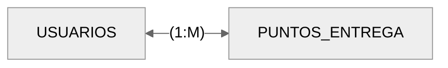
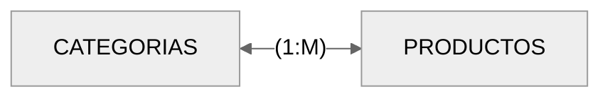
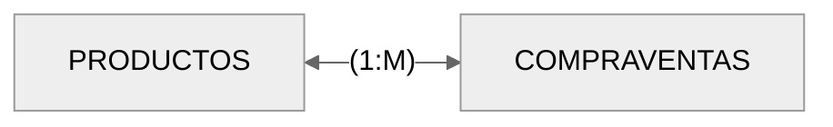
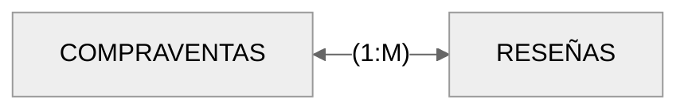
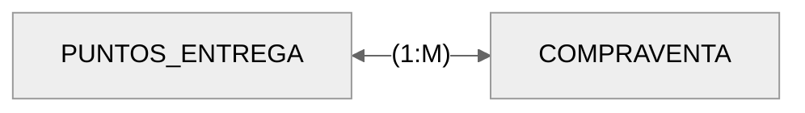
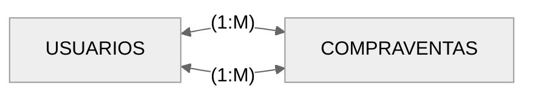
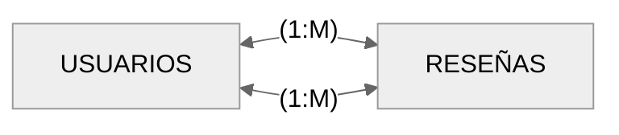

# Base de Dades: ProxiMarkt 🛒🍅

## Descripció general

La base de dades de ProxiMarkt servix per a guardar i organitzar tota la informació que necessita la plataforma per a funcionar bé. El seu objectiu és fer possible la comunicació entre compradors i venedors i gestionar coses com els productes, les reserves o els punts de lliurament.

- Motor: Mysql
- Versió: 8

## Diagrama Entitat - Relació amb atributs



### Relaciones

#### Chats - Mensajes


Cada mensaje pertenece a un único chat; un chat puede contener varios mensajes.

#### Mensajes - Usuarios


Cada mensaje es enviado por un único usuario; un usuario puede enviar muchos mensajes.

#### Usuarios - Puntos_entrega



Cada punto de entrega es asignado por un usuario; un usuario puede asignarse varios puntos de entrega.

#### Usuarios - Productos


Un usuario puede publicar varios productos; cada producto pertenece a un único usuario.

#### Chats - Productos


Cada chat está asociado a un único producto; un producto puede tener varios chats simuláneos (mismo vendedor, diferentes compradores).

#### Categorías - Productos



Cada producto pertenece a una categoría; una categoría puede tener muchos productos.

En un futuro se espera implementar que un producto pertenezca a varias categorías. E incluso que una categoría pueda tener subcategorías.

#### Productos - Compraventas



Cada producto puede generar varias compraventas; cada compraventa corresponde a un único producto.

#### Compraventas - Reseñas



Una compraventa puede generar un máximo de 2 reseñas (comprador y vendedor); cada reseña pertenece a una única compraventa.

#### Puntos_entrega - Compraventas



Una compraventa puede tener lugar en un único punto de entrega. En un punto de entrega ocurren muchas operaciones de compraventa.

#### Usuarios - Compraventas



Un único usuario con rol de comprador participa en la compraventa.
Un único usuario con rol de vendedor participa en la compraventa.
Cada usuario puede realizar muchas compraventas.

#### Usuarios - Reseñas



En cada reseña participa un único usuario reseñador.
En cada reseña participa un único usuario reseñado.
Un usuario puede tener muchas reseñas.

#### Usuarios - Chats


Un chat tiene dos únicos participantes (comprador - vendedor).
Los usuarios pueden tener muchos chats.

### Tablas y campos

#### **Tabla usuarios**

```sql
CREATE TABLE USUARIOS(
    id_usuario int AUTO_INCREMENT PRIMARY KEY,
    nombre_usuario VARCHAR(255) UNIQUE NOT NULL,
    email VARCHAR(255) UNIQUE NOT NULL,
    contrasenya VARCHAR(255) NOT NULL,
    telefono VARCHAR(20) UNIQUE NOT NULL, 
    direccion VARCHAR(255),
    longitud DECIMAL(10,8),
    latitud DECIMAL(10,8),
    created_at TIMESTAMP DEFAULT CURRENT_TIMESTAMP,
    modified_at TIMESTAMP DEFAULT CURRENT_TIMESTAMP ON UPDATE CURRENT_TIMESTAMP,
    puntuacio DOUBLE DEFAULT 0
);

```

#### **Tabla categorias**

```sql
CREATE TABLE CATEGORIAS(
    id_categoria INT AUTO_INCREMENT PRIMARY KEY,
    nombre_categoria VARCHAR(255) NOT NULL 
);
```

#### **Tabla productos**

```sql
CREATE TABLE PRODUCTOS(
    id_producto INT AUTO_INCREMENT PRIMARY KEY,
    nombre_producto VARCHAR(255) NOT NULL,
    descripcion TEXT,
    precio DECIMAL(10,2) NOT NULL,
    stock_total INT NOT NULL DEFAULT 0,
    stock_reserva INT NOT NULL DEFAULT 0,
    stock_real INT NOT NULL DEFAULT 0,
    created_at TIMESTAMP DEFAULT CURRENT_TIMESTAMP,
    imagen VARCHAR(255),
    id_categoria INT,
    estado ENUM('agotado', 'reservado', 'disponible'), 
    FOREIGN KEY (id_categoria) REFERENCES CATEGORIAS(id_categoria)
);
```

#### **Tabla chat**

```sql
CREATE TABLE CHATS(
    id_chat INT AUTO_INCREMENT PRIMARY KEY,
    id_comprador INT,
    id_vendedor INT,
    id_producto INT,
    created_at TIMESTAMP DEFAULT CURRENT_TIMESTAMP,
    modified_at TIMESTAMP DEFAULT CURRENT_TIMESTAMP ON UPDATE CURRENT_TIMESTAMP,
    FOREIGN KEY (id_comprador) REFERENCES USUARIOS(id_usuario),
    FOREIGN KEY (id_vendedor) REFERENCES USUARIOS(id_usuario),
    FOREIGN KEY (id_producto) REFERENCES PRODUCTOS(id_producto),
    UNIQUE (id_comprador, id_vendedor, id_producto)
);
```

#### **Tabla mensajes**

```sql
CREATE TABLE MENSAJES(
    id_mensaje INT AUTO_INCREMENT PRIMARY KEY,
    id_chat INT,
    id_envio INT,
    contenido TEXT NOT NULL,
    FOREIGN KEY (id_chat) REFERENCES CHAT(id_chat),
    FOREIGN KEY (id_envio) REFERENCES USUARIOS(id_usuario)
);
```

#### **Tabla puntos entrega**

```sql
CREATE TABLE PUNTOS_ENTREGA(
    id_punto INT AUTO_INCREMENT PRIMARY KEY,
    id_usuario INT,
    longitud DECIMAL(10,8) NOT NULL,
    latitud DECIMAL(10,8) NOT NULL,
    nombre_punto VARCHAR(255) NOT NULL,
    direccion_punto VARCHAR(255),
    created_at TIMESTAMP DEFAULT CURRENT_TIMESTAMP,
    modified_at TIMESTAMP DEFAULT CURRENT_TIMESTAMP ON UPDATE CURRENT_TIMESTAMP,
    FOREIGN KEY (id_usuario) REFERENCES USUARIOS(id_usuario)
);
```

#### **Tabla compraventas**

```sql
CREATE TABLE COMPRAVENTAS(
    id_compraventa INT AUTO_INCREMENT PRIMARY KEY,
    id_producto INT,
    id_comprador INT,
    id_vendedor INT,
    cantidad_total INT NOT NULL,
    id_punto INT,
    estado ENUM('pendiente', 'en curso', 'completado', 'cancelado'),
    created_at TIMESTAMP DEFAULT CURRENT_TIMESTAMP,
    FOREIGN KEY (id_producto) REFERENCES PRODUCTOS(id_producto),
    FOREIGN KEY (id_vendedor) REFERENCES USUARIOS(id_usuario),
    FOREIGN KEY (id_comprador) REFERENCES USUARIOS(id_usuario),
    FOREIGN KEY (id_punto) REFERENCES PUNTOS_ENTREGA(id_punto)
);
```

#### **Tabla valoraciones**

```sql
CREATE TABLE VALORACIONES(
    id_valoracion INT AUTO_INCREMENT PRIMARY KEY,
    id_venta INT,
    id_resenyador INT,
    id_resenyado INT,
    valoracion ENUM('1','2','3','4','5') NOT NULL,
    comentario TEXT,
    fecha DATETIME DEFAULT CURRENT_TIMESTAMP, 
    FOREIGN KEY (id_venta) REFERENCES COMPRAVENTAS(id_compraventa),
    FOREIGN KEY (id_resenyador) REFERENCES USUARIOS(id_usuario),
    FOREIGN KEY (id_resenyado) REFERENCES USUARIOS(id_usuario),
    UNIQUE (id_venta, id_resenyador, id_resenyado)
);
```
