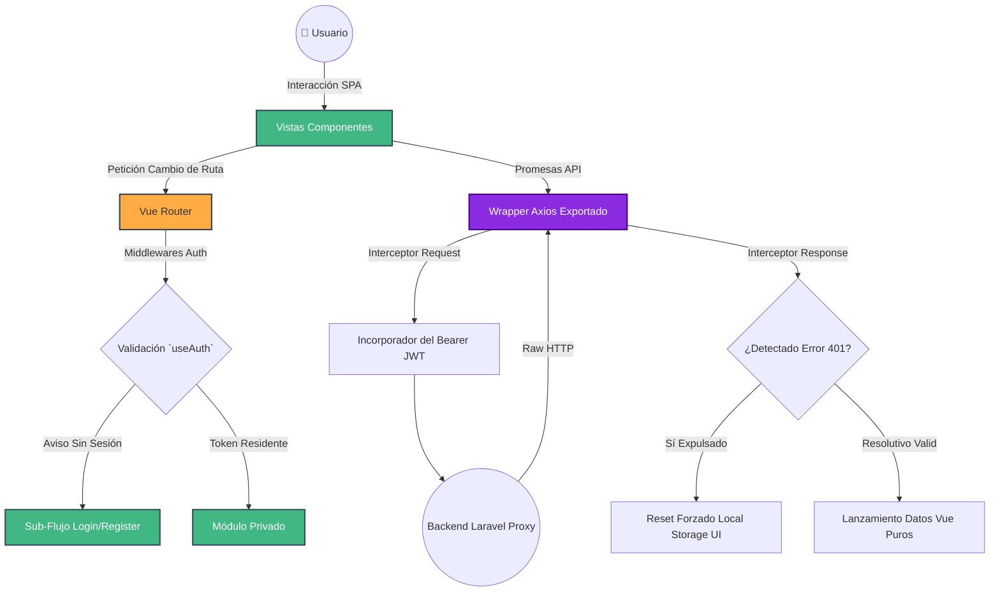
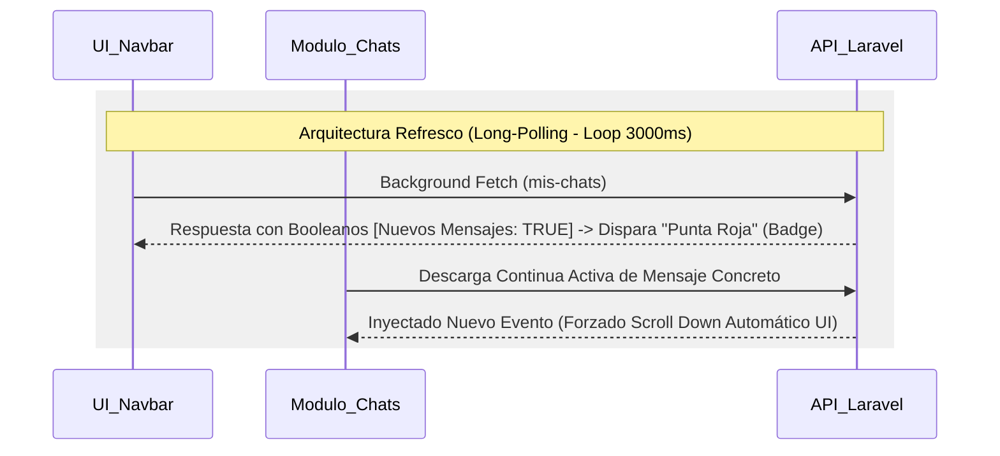

# Documentación Frontend (Vue.js)

Este archivo engloba los conceptos arquitectónicos, funcionalidades principales y justificaciones de la lógica aplicada en el desarrollo de la interfaz SPA (Frontend) de **Proxi Markt**.

---

## 1. Patrón, stack general y flujo de comunicación

El Frontend está desarrollado utilizando **Vue 3 (Composition API / `<script setup>`)** empaquetado bajo el rápido gestor modular **Vite**.

**Decisiones de Diseño Clave:**

- **Rechazo Intencionado a Frameworks Complejos (Pinia / Vuex):** Dada que la aplicación basa gran parte de su arquitectura en validación delegada a nivel de servidor, se extrajo la compartición reactiva del estado `usuario` publico base usando un mero objeto persistido en JavaScript nativo (`/composables/useAuth.js`) en lugar del habitual ecosistema estricto store de Pinia.
- **Librería Externa Leaflet Centralizada:** Se usó la variante en JavaScript "Vanilla" incrustada dentro de componentes nativos de `.vue` para los Mapeos y GIS sin wrappers adicionales por temas de flexibilización y control de fugas puntuales asíncronas de memoria (`memory Leaks`).

---

## 2. Abstracciones, control de enrutador y contextos

Existen lógicas base o fundacionales instaladas de forma global que interactúan antes, en paralelo o posteriormente a las visuales que pinta Vue en el DOM del navegador.

### Lógica router: prevención front (`/routes/routes.js`)

**Cómo actúa:**
Enrutamos dinámicamente sobre la meta-información. Añadimos pre-guardias (`router.beforeEach(async (to)`) condicionalmente programados protegiendo perimetralmente (redireccionando a `/auth`) si cualquier usuario manipula la URL directa en el navegador para componentes estandarizados cómo _Mis Productos_ y carece explícitamente en el navegador asíncrono referencial del campo credencial local.

### Middlewares client-Side HTTP (`/api/axios.js`)

**Interferencia de Comunicación Inyectable (Interceptores):**
En pro de maximizar la limpieza y el principio de responsabilidad única (DRY), no seteamos ninguna de las variables HTTP Authorize dentro de las views de detalle de `Productos` o `Registro`. Se programaron dos escudos o "Interceptores":

- _Subida (`request`):_ Examina si existe el token internamente escondido lo adjunta e incorpora de manera intrínseca sin que te des cuenta como un Header.
- _Bajada (`response`):_ Capturadora universal de Fallos y Vencimientos de Token. Si Laravel devuelve código de denegación `401 Unauthorized`, este escudo prioriza su captura interrumpiendo un potencial _console.error()_ general purificando con limpieza la aplicación local (`logout()`) y redirigiéndote.

### Abstracción de variable universal múltiple (`/composables/useAuth.js`)

**Scope "Singular/Único" Referenciado Localmente:**
Los variables reactivas `const _usuario = ref(null)` declaradas internamente en Scope aislado pero retornado vía exportación permiten que dos componentes ubicados visualmente a miles de kilómetros como `NavigationBar` y un `Checkout` hablen al milisegundo compartiendo un solo valor reactivo común persistente durante toda la ventana temporal.

---

## 3. Elementos core (home y autenticación)

### Landing page híbrida (`/views/AuthView.vue`)

**Caché Asíncrono de Modulos:**
Este archivo se aprovecha de la variable del historial del navegador estándar en JS (`history.state`) para que al lanzar links desde cualquier sitio exterior el propio contenedor decida "Inteligentemente" arrancar inicializado mostrando el `FormLogin` o decantarse en mostrar de facto el input complejo `FormRegistro`, agilizando transiciones visuales.

### Refactorización prematura condicionada (`/components/LoginForm.vue`)

**Fallo Condicionado Resolutivo Inteligente (Ubicación Cero):**
Dentro de los chequeos habituales pre-definición de Login post-backend, detecta de forma local si el usuario que Laravel le confiere carece y arrastra nulo valor su parámetro global referente de `Direccion / Cartografia`. La SPA (Vue), reescribe velozmente la ruta deseada original y enruta "Secuestrando" temporalmente a aquél usuario recién aprobado hacia configuraciones perfiles mandatorios iniciales (`/ubicacion`), para preservar la solidez del motor GIS.

---

## 4. Red asíncrona: eventos de polling (notificaciones y trazos)

### Cabecera neuronal interceptora (`NavBar.vue` y ciclo de vida crítico)

**La Invocación Recurrente Limpia (Polling Timer):**
La directiva visual en la barra superior genera un _Cronograma interno Reactivo JavaScript_ disparado bajo el Hook vital de `onMounted()`. Replicando preguntas temporizadas asíncronas al modelo de fondo de bases.
**Explicación Vital de Componente Limpio:** El uso forzado mandatorio de utilizar el hook gemelo paralelo de Vue `onUnmounted()` es prioritario. Detener expresamente la función cíclica previa purga fallos habituales SPA catastróficos que se apilan por la memoria del DOM causando colapsos y ahogos si el navegante decidiese alternar rutas y cargar Múltiples Cronómetros falsos asíncronos residuales sin destruir que seguirían haciendo llamadas al origen.

### Infinito control de slider (`ModalRadio.vue`)

Para controlar de manera semántica rangos finitos estáticos predeterminados de 1 KM, 50 Km etc.. conllevaba truncamientos. Para permitir un barrido máximo radial la herramienta lo traslapa convirtiéndolo un objeto literal pre-construido universal numérico tipo `(Infinity)` manipulable, transformándolo a `null` de paso post-comunicante hacia BD.

---

## 5. Complejidad en c.R.U.D y funcionalidades externas ancladas

### Divisiones funcionales cargas padres (`DetalleProducto.vue` y `SolicitarCompra.vue`)

**Smart / Dumb Components Pattern:**
El botón con Select numérico de `SolicitarCompra` actúa ciegamente en base de variables Reactivas primitivas recibidas. Simplemente valida la imposibilidad física limitando subida local de inputs del usuario que no correspondan matemáticamente mediante directivas al número global que tiene en lectura (Ej: Imposible tipear compra de 5 ítems de Stock de 2). Envuelve este pre-validado sin enviar APIs empaquetado y mandado asépticamente y "Sordo" hacia el Contenedor anfitrión Base ("Detalle"), único ente facultado (`Smart Provider Component`) y enrutado con importaciones de Axios de cerrar verdaderamente Transacciones Oficiales en Backend y notificar globalidades.

### Exigencia manual (destrucción mapas vanilla sobre Vue reactivo API) en `MiCuenta.vue`

**Gestión Limitante Local:**
Es muy complejo renderizar mediante Condicionamientos (`v-if` y Switchers Navagadores Vue DOM) Múltiples Tablas y librerías externas de mapas _Leaflet_ pesadas de manipulación bruta ajenos al framework.
La justificación imperante requiere destruir por evento directo listeners huérfanos generados manual y externamente (`map.remove()`) previniendo conflictos Reactivos (Ghost Rendering o Memory Heap Error colisionando 2 entornos separados DOM manipulativos cruzados).

### El truco asíncrono hibrido de fotos en `Publicar.vue`

**Manipulación Multipart/Formdata Base:**
JSON de forma estándar estricta universal rechaza o muere asimilando codificaciones empaquetadas binariamente masivas. En vez de recurrir y entorpecer la carga pasando Archivo ➔ a codificación lenta Textual Base64 local. Despliega forzosamente a Axios inyectando y reestructurando una clase predefinida Base Browser `(new FormData())`. Anexándole asimétricamente la referencia al Payload crudo capturado `($event.target.files)`. El Backend (Laravel Proxy) lo absorbe transparentemente reconociendo cabeceras. Eliminando ralentización y saltándose topes de procesamiento Base64 en red.
