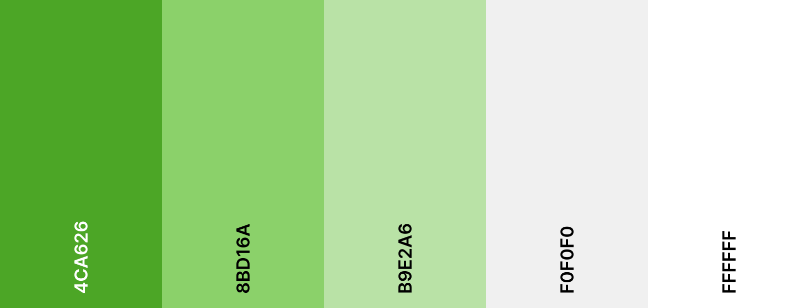
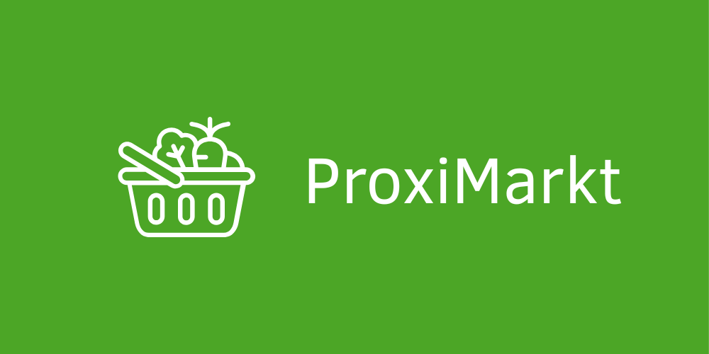
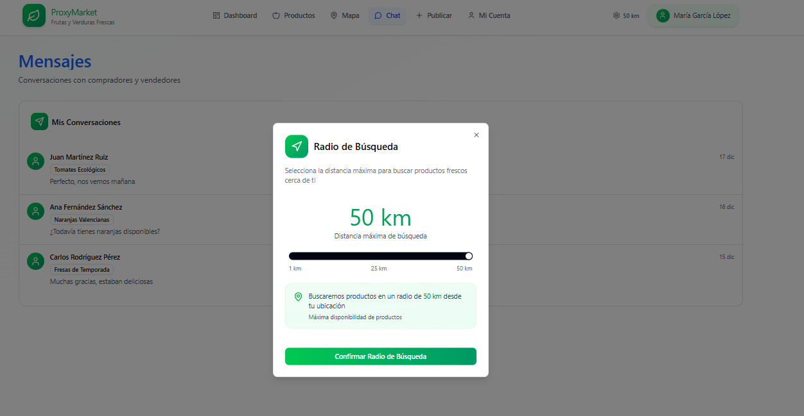
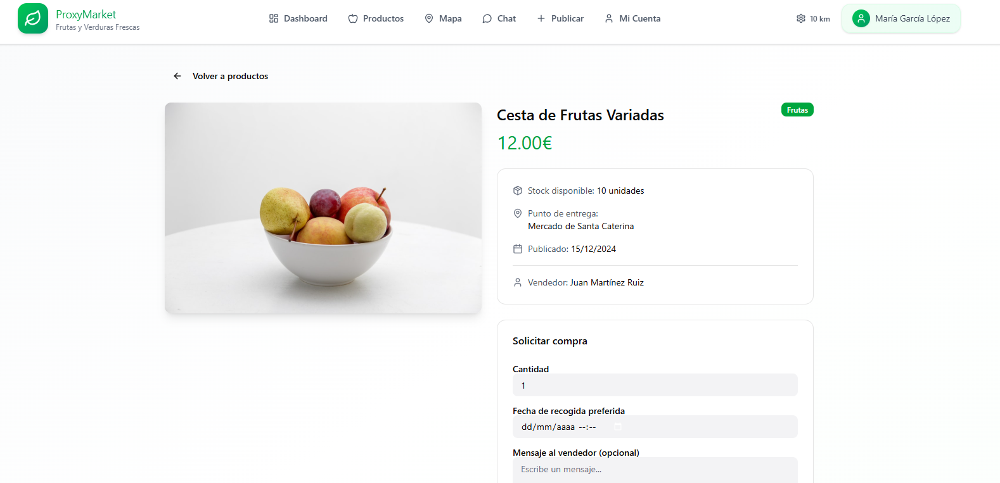
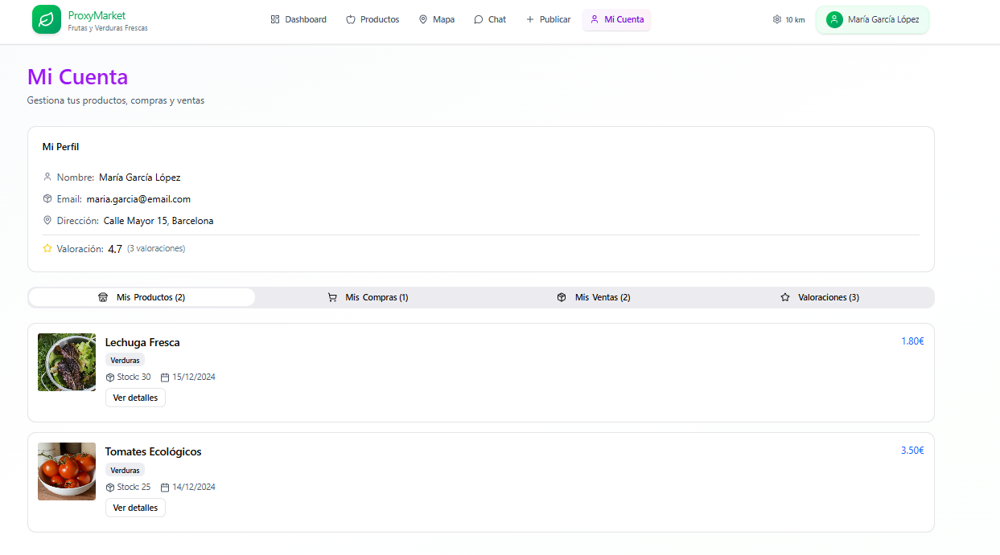
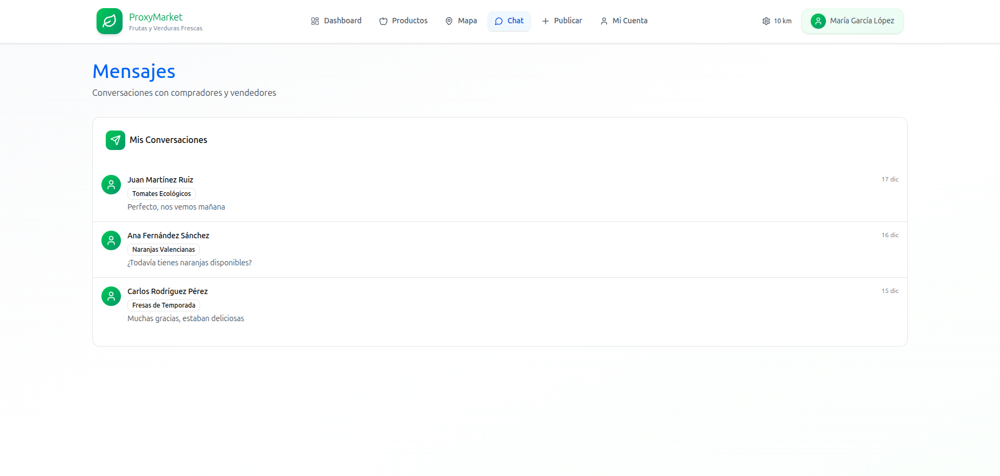
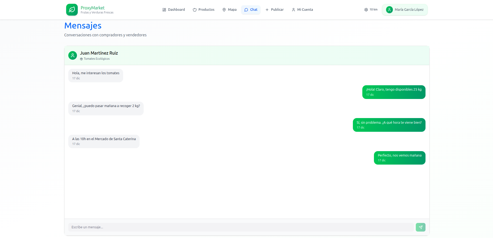

# Prototipo: ProxiMarkt 🛒🍅

## Descripción general

ProxiMarkt es una plataforma donde se pueden vender y comprar productos como frutas y verduras del mercado local de forma sostenible.

### Tecnologías usadas

Frontend: HTML, CSS, JavaScript con Vue
Backend: PHP con Laravel

### Estilos

#### Paleta de colores

En corcondancia con la intencionalidad de la plataforma, la paleta de colores se centra en ser sencilla y enfocada en tonalidades de verdes para darle un toque natural y minimalista.

---

#### Logos

- El color de fondo es: #4ca626.
- Color de letra: #FFFFFF.
- Tipografía es: Clear Sans.

Actualmente existen dos variantes para el logotipo. Una con fuente y otra sin fuente, para adaptarlos a diferentes escenarios. En el futuro se plantea realizar otras versiones (negativo, contraste, etc.)

| Pequeño | Grande |
| --- | --- |
|  |  |

---

### Prototipo

#### Pantalla de registro

Formará parte de la página principal y podremos rellenar los campos de registro para poder crear una cuenta y poder entrar a la aplicación.

---

#### Inicio sesión

Esta será la pagina de inicio, donde vamos a poder iniciar sesión si ya tenemos creada una cuenta. Se validarán las credenciales del usuario que se creó anteriormente y nos dejará entrar si están escritas correctamente.

---

#### Dashboard

Tendremos un panel de control con información de nuestra cuenta personal, como por ejemplo: mis productos, stock total, ventas pendientes y ingresos.

Además tendremos información como las ventas recientes, productos con mayor stock y las compras recientes del usuario.

---

#### Radio de búsqueda

Podremos modificar la distancia del rango de búsqueda para que depende de los kilómetros nos salgan unos productos u otros.

---

#### Productos

En el apartado de productos tendremos una serie de tarjetas de productos disponibles y su información más relevante, estas tarjetas dependerán de el rango de busqueda que hayamos seleccionado anteriormente. Tendrá un botón para saber más detalles sobre ese producto.

Dispondrá de un buscador donde pondrás lo que quieras buscar por nombre y un botón para poder filtrar por categoría.

---

#### Mapas

Al darle al mapa tendremos un mini mapa que nos dindicará donde nos encontramos nosotros según nuestra ubicación y los productos más cercanos según el rango introducido anteriormente.

Al apretarle a uno de los productos del mapa se nos abrirá ese mismo producto en en otra página donde sabremos sus detalles y podremos rellenar un formulario para comprarlo.

---

#### Publicar

Para publicar un producto tendremos que rellenar un formulario con información relevante, por ejemplo: el nombre del producto, una descripción breve y su precio entre otras cosas.

En cualquier momente podremos cancelar la creación del producto o si vemos que está todo correcto publicarlo y de manera automática ya le saldrá al resto de compradores.

Al publicar el producto se actualizará el apartado del mis productos del dashboard.

---

#### Mi cuenta

##### Mis productos

En el apartado "Mi Cuenta" podremos visualizar la información relevante del propietario de la cuenta y las valoraciones que le ha hecho la gente.

Por defecto estará seleccionada la opción "Mis Productos" en el submenú de infromación del usuario. Aquí veremos información sobre los productos que hayan sido publicados, su stock, la fecha de publicación, el precio y un botón con más detalles del producto.

##### Mis compras

Este apartado del submenú nos mostrará las compras que hayamos hecho y información relevante como el estado del pedido, la cantidad, el precio y quien es el vendedor entre otras cosas.

##### Mis ventas

En "Mis ventas" podremos ver los productos que hayamos vendido y su estado, además de la información relevante comentada en el párrafo anterior.

##### Valoraciones

Por último tendremos el apartado "Valoraciones" donde podremos ver las valoraciones que nos han hecho los compradores. Podremos ver el nombre del dueño de la valoración, las estrellas, un comentario sobre el producto y la atención, la fecha y que producto nos ha comprado para poder dejarnos esa valoración.

#### Chat

Se establece como mecanismo principal de comunicación entre compradores y vendedores. Permitiendo acordar cosas que no estén integradas como opciones dentro de la aplicación. Puntes de entrega diferentes, regateos de precio, etc.

Por un lado tenemos la vista de todos los chats abiertos.

El interior de los chats es donde se muestran los mensajes entre usuarios. Los mensajes son almacenados en la base de datos. Es una implementación temporal ya que se planea realizar un websocket para comunicación online en tiempo real.

