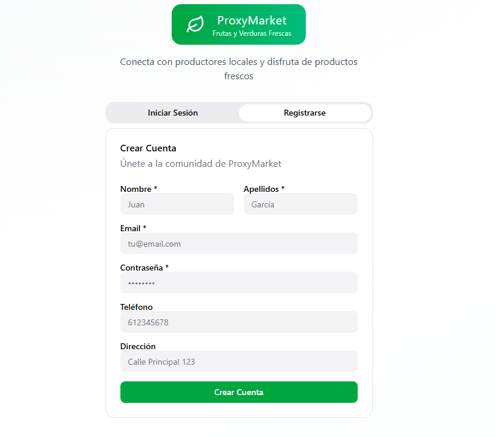
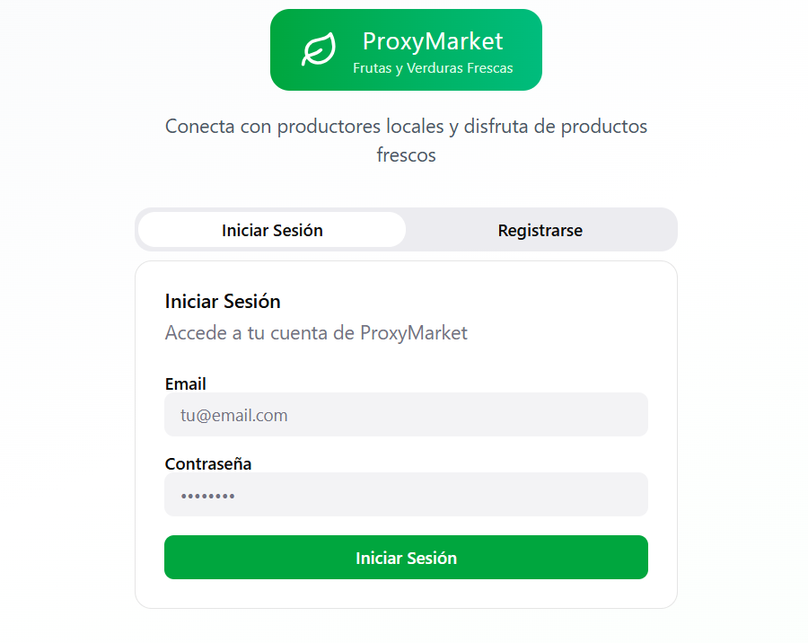
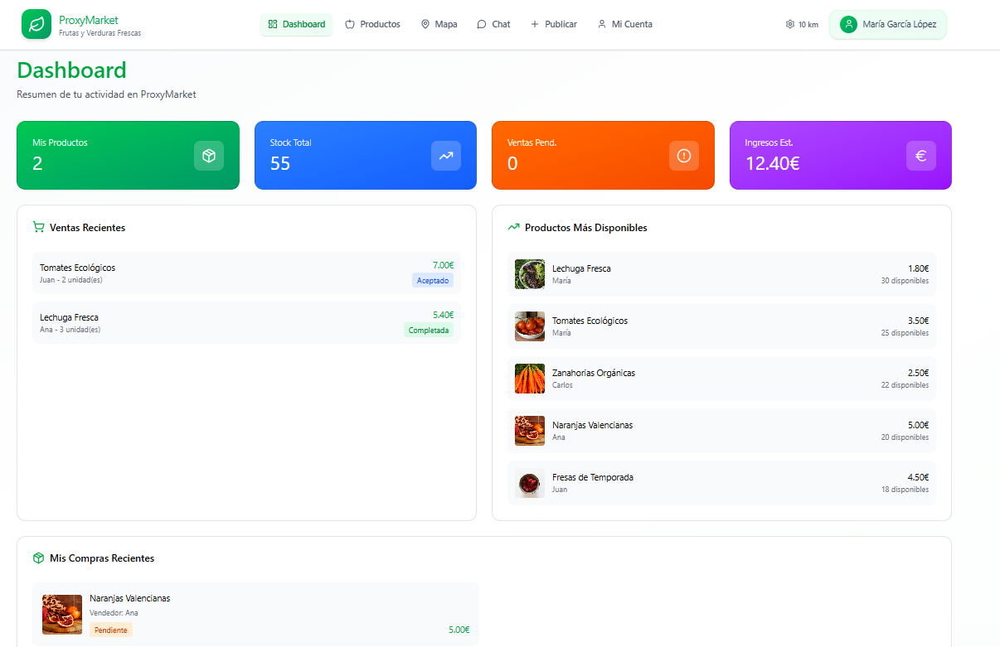

# Prototip: ProxiMarkt 🛒🍅

## Descripció general

- Motor: HTML, CSS, Vue, JavaScript

### Registrarse

Formará parte de la página principal y podremos rellenar los campos de registro para poder crear una cuenta y poder entrar a la aplicación.

---

### Iniciar sesión

Esta será la pagina de inicio, donde vamos a poder iniciar sesión si ya tenemos creada una cuenta. Se validarán las credenciales del usuario que se creó anteriormente y nos dejará entrar si están escritas correctamente.

---

### Dashboard

Tendremos un panel de control con información de nuestra cuenta personal, como por ejemplo: mis productos, stock total, ventas pendientes y ingresos.

Además tendremos información como las ventas recientes, productos con mayor stock y las compras recientes del usuario.

---

### Productes

### Publicar